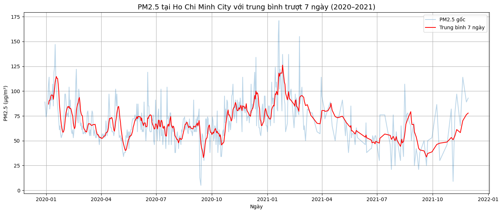
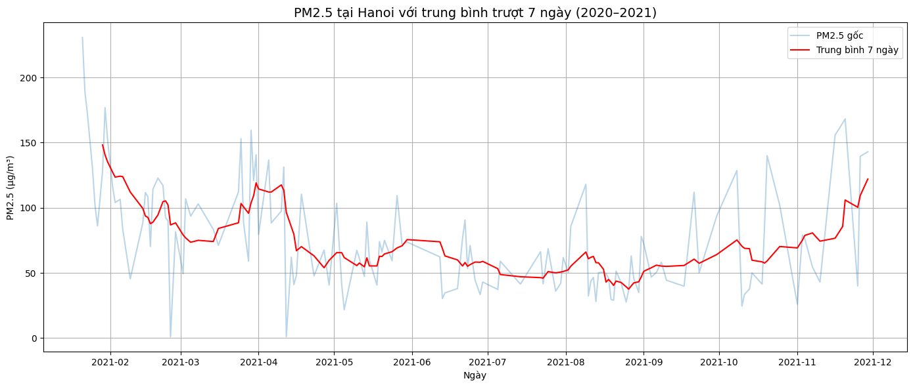
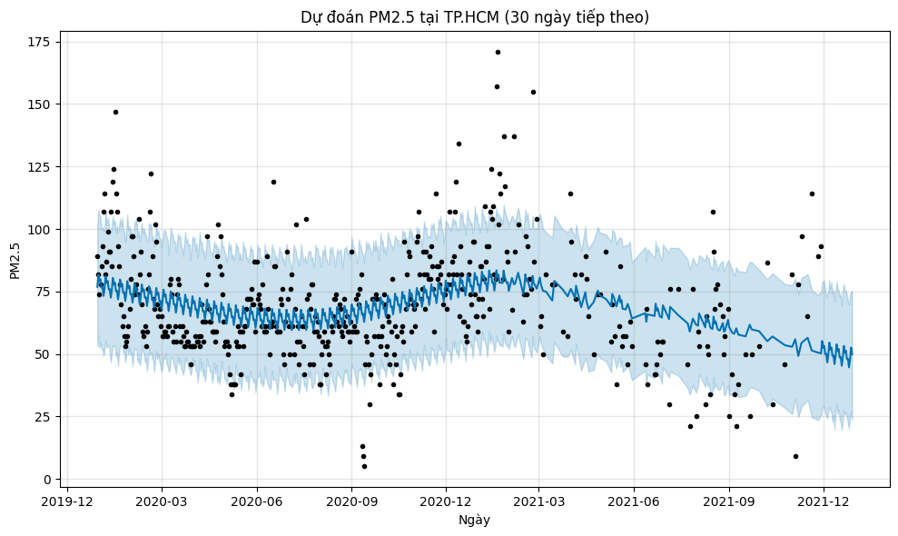
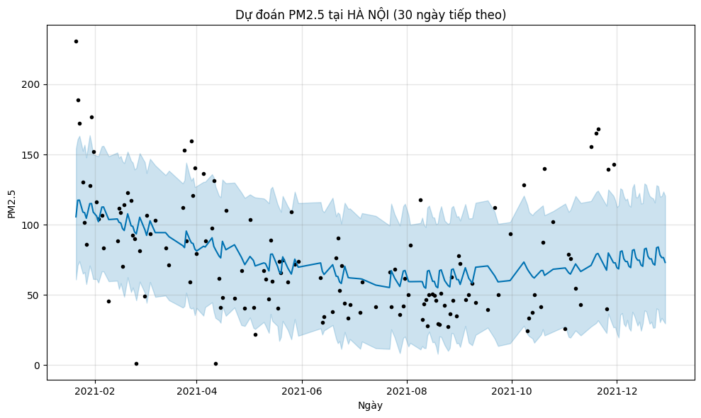

# Phân tích xu hướng và dự đoán chất lượng không khí tại Hà Nội và TP.HCM

Giới thiệu dự án

Dự án tập trung phân tích xu hướng chất lượng không khí tại Hà Nội và Thành phố Hồ Chí Minh, đồng thời xây dựng mô hình dự đoán chất lượng không khí dựa trên dữ liệu lịch sử.

Mục tiêu

- Phân tích dữ liệu chất lượng không khí theo thời gian.
- So sánh xu hướng chất lượng không khí giữa Hà Nội và TP.HCM.
- Xử lý và làm sạch dữ liệu.
- Trực quan hóa các chỉ số chất lượng không khí.
- Dự đoán xu hướng chất lượng không khí trong tương lai.

Cấu trúc dự án

1_data
Chứa các tập dữ liệu được sử dụng trong dự án.

2_code
Chứa mã nguồn và notebook thực hiện quá trình xử lý, phân tích và dự đoán dữ liệu.

3_report
Chứa báo cáo chi tiết của dự án.

images
Các hình ảnh trực quan hóa và kết quả phân tích.

Công nghệ sử dụng

- Python
- Pandas
- NumPy
- Matplotlib
- Scikit-learn
- Prophet
- Google Colab / Jupyter Notebook

Kết quả phân tích

Xu hướng PM2.5 tại TP.HCM

### Xu hướng PM2.5 tại Hà Nội

## 🔮 Kết quả dự đoán

### Dự đoán PM2.5 tại TP.HCM trong 30 ngày tiếp theo

### Dự đoán PM2.5 tại Hà Nội trong 30 ngày tiếp theo

